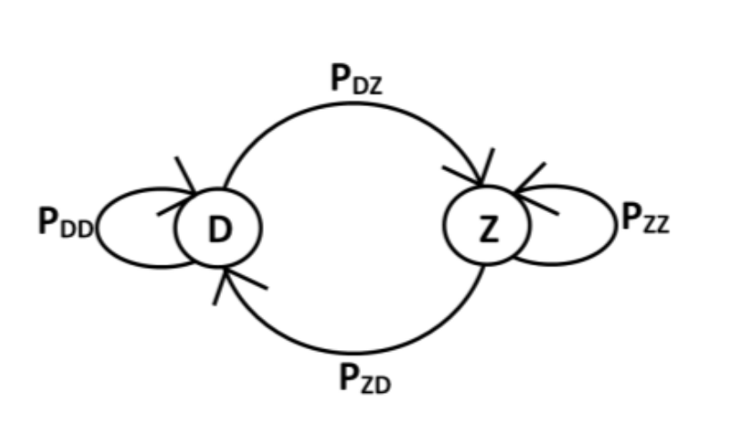
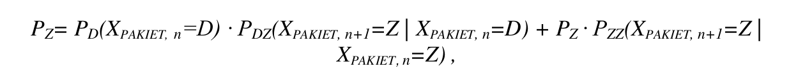
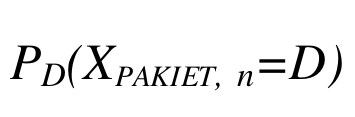
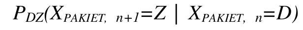

# GilbertModel
Research on the evaluation of speech signal transmission quality degradation in the IP network as a result of
packet loss, can be carried out provided a mathematical model. It's allow to introduce these disturbances into the signal in a
controlled manner. Several mathematical models of the phenomenon of loss have been proposed in the literature, which are
the Bernoulli model and a more complex model based on
Markov's chain. According to data
relatively simple, providing an accurate approximation of the phenomenon of loss
of packets in packages, is the Gilbert model. It assumes that the state of the current packet
depends only on the state of the package preceding it.

If we assume that X is a random variable representing the result of packet transmission
at time n, then Xn is the sequence of events where n є N, is a discrete Markov series. The transmission
result can take one of two states marked as: D (packet
delivered) and Z (packet lost). Probability of transition to state Z when
the previous state was also state Z, it is defined as follows: Pzz(X,n+1=Z |
X, n=Z) = clp. The random variable X has a geometric distribution. Thus, the probability that BL of consecutive packets
(package) is lost, it is defined as follows:

Mean Burst Loss Length (MBLL) is an expectations value geometric series

The probability Pz of the packet's Z state occurrence is called the probability
packet loss and is defined as follows

where Pd

is the probability that the packet is in state D

is the probability of state Z when the packet
the former was in state D
The PZ variable is the basic parameter defining
packet loss rate. It is also defined as the ratio of the number of packets
lost to the number of packets sent in a given time unit
